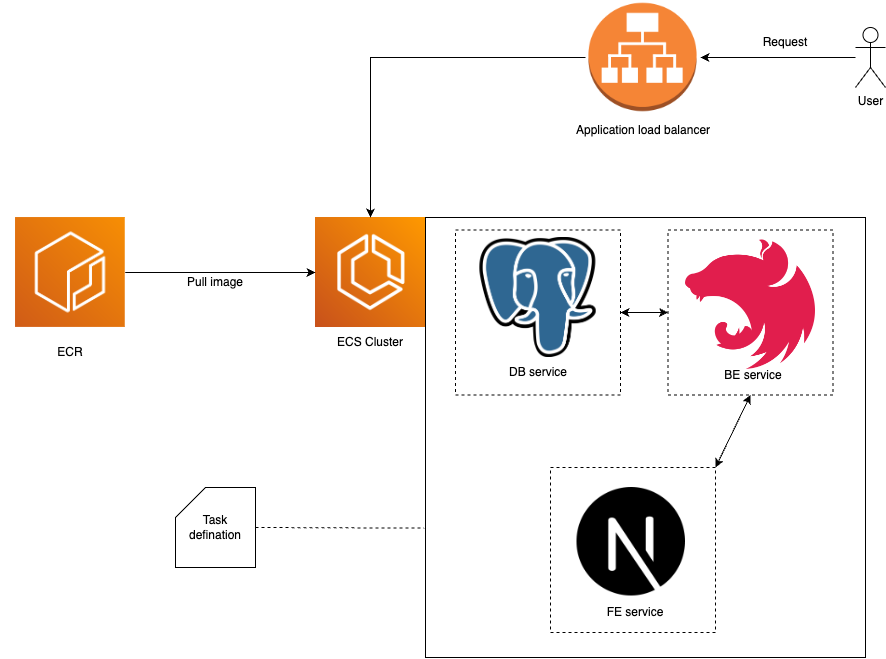

# Video Sharing Application

## Introduction

This project is a video-sharing application that allows users to register, log in, share YouTube videos, and like or unlike videos shared by others. The application is built using modern web technologies, focusing on performance, scalability, and ease of use.

Link app: http://share--publi-e28o0aiccghh-1447109741.ap-southeast-1.elb.amazonaws.com/


AWS deployment diagram:



### Key Features:

- User registration and login.
- Posting YouTube video URLs.
- Viewing a list of shared videos.
- Liking or unliking videos.
- Responsive design, suitable for both desktop and mobile devices.
- Real-time notification when a user shares a video.

## Prerequisites

Before you begin, ensure you have the following software installed:

- **Node.js** (v14.x or higher)
- **npm** (v6.x or higher) or **yarn** (v1.x or higher)
- **PostgreSQL** (v13.x or higher)
- **Docker** (v20.x or higher) and **Docker Compose** (v1.27.x or higher) (for Docker deployment)
- **Git** (v2.x or higher)

## Installation & Configuration

Follow these steps to set up the project locally:

1. **Clone the repository:**

   ```bash
   git clone https://github.com/nhathoang241199/Hoang_Duc_Nhat_Dev_Test.git
   ```

2. **Install dependencies:**
   1. For back-end:
      ```bash
      cd back-end
      yarn
      ```
   

   2. For front-end:
      ```bash
      cd front-end
      yarn
      ```

3. **Environment Configuration:**
   
   1. For back-end:
      ```bash
      DB_HOST=localhost
      DB_PORT=5432
      DB_USERNAME=admin
      DB_PASSWORD=123456
      DB_NAME=video_share_db
      SECRET_KEY=secretKey
      ```

   2. For front-end:
      ```bash
      NEXT_PUBLIC_API_URL=http://localhost:3001
      ```
      
5. **Setup Database**

   1. Create the PostgreSQL database:
      ```bash
      psql -U admin -c "CREATE DATABASE video_share_db;"
      ```

   3. Run Migrations:
      ```bash
      yarn migrate
      ```

6. **Run the application**
   1. For back-end:
      ```bash
      npm run start:dev
      ```

   2. For front-end:
      ```bash
      npm run dev
      ```
   Then open your browser and navigate to http://localhost:3000.

   3. Run the test suite:
      ```bash
      yarn test
      ```

7. **Docker deployment**
   ```bash
   docker-compose up --build
   ```
   
   Then open your browser and navigate to http://localhost:3000.

8. **Usage**

   Register/Login: Create an account or log in to an existing one.
   
   Share Video: Click on "Share video" and paste the YouTube URL to share.
   
   Like/Unlike Videos: Use the like/unlike buttons to vote on shared videos.

10. **Troubleshooting**
    
    Issue: Application won't start. Solution: Ensure all dependencies are installed and the .env file is correctly configured.

    Issue: Database connection errors. Solution: Verify that PostgreSQL is running and the database credentials in the .env file are correct.

    Issue: Docker container not starting. Solution: Check the Docker logs for any errors and ensure Docker is properly installed and running.
